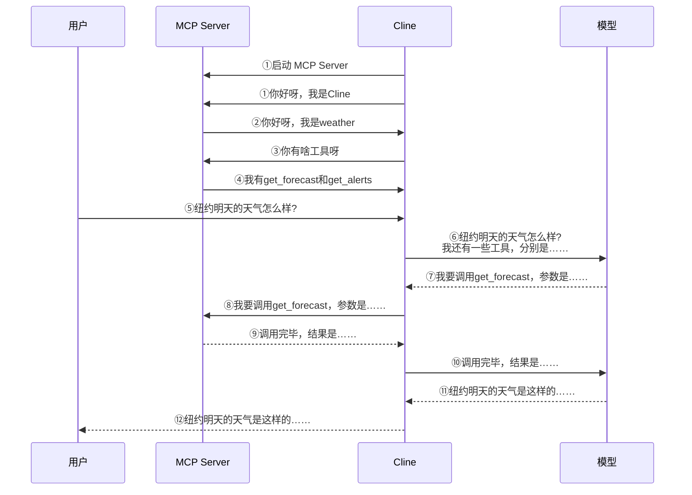

## MCP基础了解

model context protocol（模型上下文协议）

2024年11月25


### 用途

- 帮助大模型更好地使用工具
  - 让模型上网查询信息
  - 让模型操作unity编写游戏
  - 让模型查实时路况

### MCP HOST

- 常见的MCP HOST
  - Claude Desktop
  - Cursor
  - Cline
  - Cherry Studio
- 以Cline为例
  - 安装在vs中的插件
  - 要配置
    - 一个plan mode：负责思考，建议选择强大模型
    - 一个act mode：负责执行，建议选择廉价模型

### MCP Server

> 与传统意义的Server没有太大关系，本质只是一个程序
>
> 大部分的MCP Server都是由node和python启动，不管连不连网都可以
>
> - node用npx（uv tool）启动
> - python用uvx启动

### 使用MCP服务



### 直接在MCP HOST中调用外部mcp服务的步骤

先配置MCP HOST的json文件，具体需要去mcp服务市场查找，然后你用的MCP HOST就可以调用该外部的服务

> 下面是具体的json配置文件，包含fetch与hotnews两个服务

```json
{
  "mcpServers": {
     "fetch": {
        "args": [
          "mcp-server-fetch"
        ],
        "command": "uvx"
    },
    
    "mcp-server-hotnews": {
      "command": "npx",
      "args": [
        "-y",
        "@wopal/mcp-server-hotnews"
      ]
    }
  }
  
}
```

## 在本地自己编写MCP Server并用MCP HOST调用

> 本质就是写一个python文件，里面就是具体的工具函数，然后配置json文件，让MCP HOST可以识别到该程序并启动。

**第一种测试**

写好程序后并配置json文件（表明文件在哪，如何启动）后，如果直接在vs中，第一章下载的cline（MCP HOST）扩展可以直接识别到，就可以直接问cline（MCP HOST）,并且调用工具回答。

**第二种测试**

写一个python文件放在cline（MCP HOST）与用户之间，截获输入输出，从而更好的了解MCP的运转

> jsonschme是一种特殊的json文件，它可以描述另一个json文件

**第三种测试**

甚至不需要MCP HOST，直接与MCP Server发送消息

> 具体做法是用截获的日志模仿MCP HOST


## MCP是否要钱


# 先说核心结论

**MCP 协议本身完全免费开源 ≠ MCP 调用的外部工具全部免费。**

费用分成三层，一定要区分清楚：

1. **MCP 标准协议、官方 SDK、MCP 服务端代码：永久免费、开源（MIT 协议），Anthropic 不收一分钱。**
2. **MCP 只是一层通用 “连接器”**，它本身不提供任何数据 / 能力；成本来自**MCP Server 背后对接的第三方服务**。
3. 工具分为三类：纯免费、有限免费额度、全程付费。

## 一、三类 MCP 外部工具详细区分

### 1）【零费用、无需密钥、纯免费工具】（你看到 wttr.in 就属于这类）

原理：MCP 服务端直接调用公开开放的免费 HTTP 接口，**不需要注册 key、不限量 / 宽松限流**

典型例子：

- wttr.in 天气 MCP
- 本地文件读写、本地 shell 执行（文件系统 MCP）
- 简易网页抓取 fetch（直接请求公开网页）
- DDG 无密钥网页搜索
- Context7 开源文档检索（公共库免费）

⚠️ 风险：这类公共接口有**隐性限流**，高频连续调用容易被封禁 IP，适合个人轻度使用。

### 2）【免费额度 + 超额收费（Freemium）｜最常见】

MCP Server 需要填入你的 API Key；**少量调用免费，超过额度产生账单**

高频例子：

- Brave Search、Serper 联网搜索
- OpenWeatherMap 天气
- GitHub API（免费请求有上限）
- 各类国内数据 API（天聚数行等）
- 向量数据库、托管浏览器渲染服务（Playwright 云服务）

> 重点：钱是第三方服务商收取，**不是 MCP 协议收费**。

### 3）【必须付费、无永久免费额度】

商业化接口、企业服务封装的 MCP 工具，测试额度极少或完全收费：

- 专业爬虫服务 BrightData
- 商业化短信、快递、地图定位 API
- 商业数据库查询 MCP 服务
- 云端托管 MCP 平台（MCP Cloud 等）

## 二、容易混淆的 2 个关键误区

### 误区 1：只要开源 MCP Server = 使用免费

❌ 错。

开源只是代表**MCP 服务端代码免费下载**，不代表它对接的上游 API 免费。

例如 `brave-search-mcp` 代码开源，但你必须自己买 Brave 搜索配额。

### 误区 2：本地运行 MCP 就不会花钱

✅ 本地运行代码本身无成本；

但只要 MCP 向外调用第三方远程 API，**依旧消耗对方额度，超额扣费**。

## 三、快速判断一个 MCP 工具会不会花钱

看配置文件 / 文档两点：

1. 是否要求填写 `API_KEY / token`
   - 不需要密钥 → 大概率纯免费（注意隐性限流）
   - 需要密钥 → 一定存在配额 / 付费规则，去对应服务商官网查计费
2. 依赖的服务是公开静态资源，还是商业云端 API

## 四、结合你之前关心的场景举例

- wttr.in MCP：**不需要 key，纯免费**，个人日常查询足够；短时间疯狂刷屏会触发 IP 限流。
- Hermes Agent 内置的各类 MCP 工具：
  - 文件操作、本地命令：免费
  - 联网搜索、地图、高级天气：取决于你填入的第三方 API 账号套餐

## 补充实用建议

1. 开发测试优先选用「无 Key 免费工具」控制成本；
2. 所有带 API Key 的服务，后台开启**用量告警、消费上限**，防止不小心超额扣费；
3. 高频场景，优先自己部署私有化接口替代公共免费 API，规避限流。


